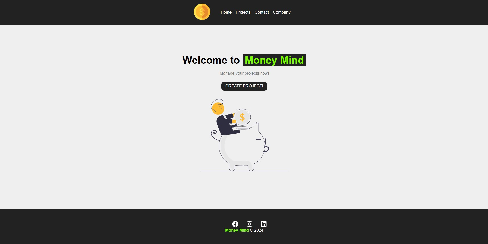
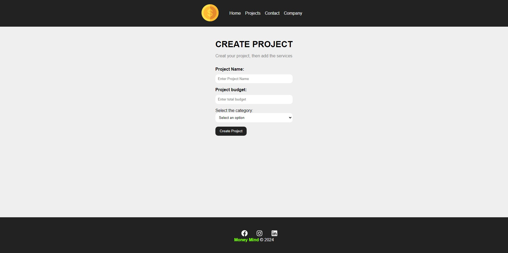
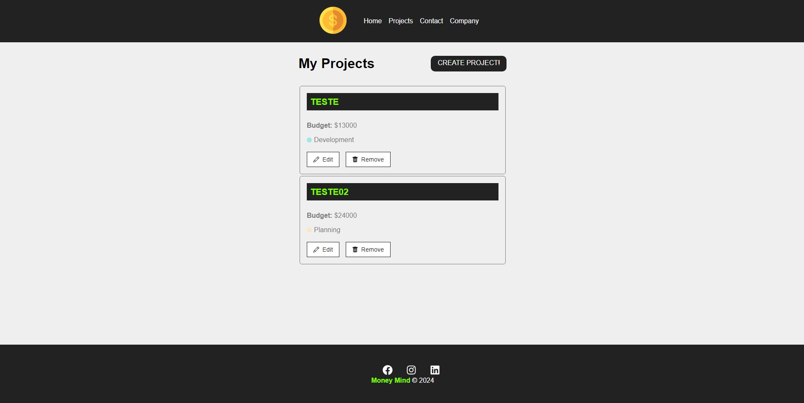

# Money Mind 

### Description

- Intent of the project: Create a page that can help company administrators with better financial management  
  in addition to assisting in the administration of new projects, for example,  
  helping in the creation of a new sector of the company, being able to place the entire project budget  
  and services that will be used!

- Fully responsive design, user-friendly! :D

### Technologies used

- JavaScript
- HTML 
- CSS
- ReactJs

# Extras

- Developed completely in english
- Website developed as **study material, non-authorial project!**